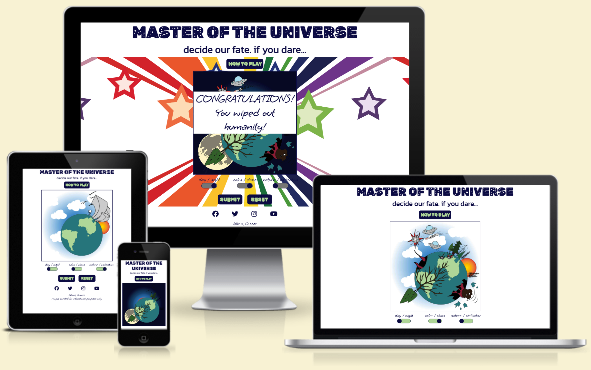
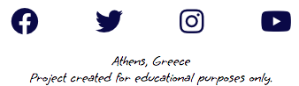

# Master of the Universe
Master of the Universe is an interactive site that turns art into a game. By selecting the correct combination of images, the user is greeted with either a win screen with vibrant colours designed to bring joy, or a lose screen that asks them to try again. In this way, the user is given the chance to build up the drawing as they like.

The Master of the Universe site is live, the links can be found [HERE](https://cluelessbiker.github.io/project2-master-universe/index.html)

## Table of Contents
+ [UX](#ux "UX")
  + [Site Purpose](#site-purpose "Site Purpose")
  + [Site Goal](#site-goal "Site Goal")
  + [Audience](#audience "Audience")
  + [Communication](#communication "Communication")
  + [Current User Goals](#current-user-goals "Current User Goals")
  + [New User Goals](#new-user-goals "New User Goals")
+ [Design](#design "Design")
  + [Colour Scheme](#colour-scheme "Colour Scheme")
  + [Typography](#typography "Typography")
  + [Imagery](#imagery "Imagery")
+ [Features](#features "Features")
  + [Existing Features](#existing-features "Existing Features")
+ [Testing](#testing "Testing")
  + [Validator Testing](#validator-testing "Validator Testing")
  + [Unfixed Bugs](#unfixed-bugs "Unfixed Bugs")
+ [Technologies Used](#technologies-used "Technologies Used")
  + [Main Languages Used](#main-languages-used "Main Languages Used")
  + [Frameworks, Libraries & Programs Used](#frameworks-libraries-programs-used "Frameworks, Libraries & Programs Used")
+ [Deployment](#deployment "Deployment")
+ [Credits](#credits "Credits")
  + [Content](#content "Content")
  + [Media](#media "Media")

## UX

### Site Purpose:
The design of an interactive little challenge that is meant to involve the user in creating the final art project. There is only one right answer though, and this will be revealed upon the right combination of switches being engaged. Upon which, a new background will load accompanied by a congratulatory message.

### Site Goal:
To engage the users interests with vibrant design & fun images, and to keep them coming back to try again. 

### Audience:
Anyone & everyone with time to spare. The ideal user age is between 15-30 years of age.

### Communication:
With bold text & clearly defined buttons, the instructions of the game become clear upon visiting the site. However for those who need a little more guidance, an instructions window has also been added, to load upon request.

### Current User Goals:
To keep the user interested & engaged, trying again & again to get the correct combination of switches. With three switches, & three positions for each switch, the number of possible combinations is 27. 

### New User Goals:
To become instantly engaged with the design of the site, and feel intrigued to play along.

### Future Goals:
To add additional interactive playing fields so that the user can choose from a number of different scenarios. As well as to add the option to increase the level of difficulty.

## Design

### Wireframes:

### Colour Scheme:
Two colours were used in the creation of this site. The green tone matches the same green used in the default image of the planet Earth, and was used to tie the imagery to the text. A dark blue was also used, and chosen to mimic the imagined hue of the universe. The rest of the colours come from the images themselves, with additional colour being thrown at the user in a beautiful rainbow upon game win.

### Typography:
All fonts were obtained from the Google Fonts library. I chose the following three fonts for the page:
1. Rubik Moonrocks - This is the main heading font, and it resembles the universe. It felt fitting to the design.
2. Kanit - for the tagline. I wanted it to be easy to read.
3. Grape Nuts - for the labels of the toggle switches & footer text. As it looks handwritten, it fits with the feel of the doodle/drawing that can be manipulated. It has also been used in the win/lose messages.
4. Rubik Wet Paint - To give an eerie feel to the submit & reset buttons.

### Imagery:
All images used were created by me, and styled to give it the feel of an interactive colouring book.

## Features

### Existing Features:

#### Landing Page:

#### Page Title:

#### Instructions Panel:

#### Game Area:

#### Win Screen:

#### Lose Screen:

#### Social Links:

### Features Left to Implement

## Testing
The default page image, along with the favicon were loading in the gitpod preview of the site, however would not load through the link generated in github. A friend suggested that the error lay with my file paths starting with a "/", and that my image name also contained a space. Once the space & the starting "/" were removed, the issue was resolved. Thank you [Mats](https://github.com/Pelikantapeten).

I struggled to understand how to add an event listener that would also indicate which radio button was toggled. After several hours of trying to understand what I was doing wrong, I contacted C.I. tutor support, and Ger was king enough to show me I had a an errant capital letter in my JS file. Upon removing it, I was then able to call the radio buttons within the functions.

Once the functions for all the overlays was in place, it became clear that the second set of toggles caused the image to move places on the screen if the second set of overlays was toggled back & forth. Issue appears to be because the function is creating a new img element each time the button is clicked & appending it to the DOM, causing the relative positioning of the third function to adjust its positioning in comparison. After much trial & error, and the help of Mats, I was able to understand that whilst I was correctly clearing out my div elements, I was placing my code in the wrong order, and clearing out my newly created img elements as well. Repositioning my code resolved the issue. This section of coding was eventually removed, and empty img elements were added to the DOM, as the issue was transferring to another overlay.

An event listener for keypress has been added to the submit button. This only appears to function after the submit button has been clicked on once. Prior to that, hitting the 'enter' key produces no results. Ger from tutor support tested the code & confirmed that the event listener works on page load, and had other colleagues also test it. They suggest that my pop-up blockers are the source of my frustrations. As multiple people have now tested it & confirmed it to be working, it is not a bug at all.

The "lose message" only appears once when the submit button is clicked. After that, it does nothing. Discovered that it was the same issue I had experienced earlier, whereby the creation of the new elements in the JS file when clicked, causes the message to shift positioning. To resolve this, I created the img elements in the html file, and loaded them with the default images for the neutral position of each toggle. This ensured that any positioning created in CSS, will no longer be affected by the creation/deletion of new elements. Now, the 'lose screen' loads in the correct place every time.

I was unable to change the background colour of the sliders by calling the element classes, and when trying to do so, this caused an issue with my function & effectively disabled it. I am still uncertain as to why this occurred. This was resolved by creating an id for each of the slider fields, and then calling upon those elements in JS. 

### Validator Testing
- html files pass through the [W3C validator](https://validator.w3.org/) with no issues found.

- CSS files pass through the [Jigsaw validator](https://jigsaw.w3.org/css-validator/) with no issues found.

- JS files pass through [JSHint](https://jshint.com/) with no issues found.

- page has an excellent Accessibility rating in Lighthouse

- Tested the site opens in Brave, Chrome & Safari without issues.
- All links open to external pages as intended.

### Unfixed Bugs

## Technologies Used
### Main Languages Used
- HTML5
- CSS3
- Javascript

### Frameworks, Libraries & Programs Used
- Google Fonts - for the font families: 
- Font Awesome - to add icons to the social links in the footer element.
- GitPod - to create my html files & styling sheet before pushing the project to Github.
- GitHub - to store my repository for submission.
- Balsamiq - were used to create mockups of the project prior to starting.
- Am I Responsive? - to ensure the project looked good across all devices.
- Favicon - to provide the code & image for the icon in the tab bar.
- Adobe Illustrator - to create the interactive artwork.

## Deployment
The site was deployed to GitHub pages. The steps to deploy are as follows:
- In the GitHub repository, navigate to the Settings tab
- From the source section drop-down menu, select the Master Branch
- Once the master branch has been selected, the page will be automatically refreshed with a detailed ribbon display to indicate the successful deployment.
- The live link can be found [HERE - Master of the Universe](https://cluelessbiker.github.io/project2-master-universe/index.html)

## Credits

### Content
Support was provided by my fellow student & friend [Mats](https://github.com/Pelikantapeten) by aiding me in bouncing off ideas & venting frustrations. They also provided immeasurable support when my brain was too tired to think straight, & helped me to work through my issues with a second set of eyes. I cannot thank them enough for being there for me.

Also a huge thank you to my mentor, Martina T. who went above & beyond to give her time & energy, and was incredibly encouraging.

Code for the HTML radio buttons & how to turn them into a toggle switch through CSS came from [Codepen](https://codepen.io/timtech/pen/ezRamp). A number of modifications were made, however the core structure is entirely credited to Codepen.

Adding an event listener for radio buttons came from [Telusko](https://www.youtube.com/watch?v=r3Oc4IUP0XI)

Adding an image element to the DOM [Stackoverflow](https://stackoverflow.com/questions/7802744/adding-an-img-element-to-a-div-with-javascript)

Code for changing the image source in JS came from [DelftStack](https://www.delftstack.com/howto/javascript/change-image-src-javascript/#:~:text=Change%20the%20Source%20of%20an,image%20using%20the%20src%20property.)

[StackOverflow](https://stackoverflow.com/questions/21166860/check-a-radio-button-with-javascript) showed me how to change which radio button is checked through JS.

Instructions for adding a background image came from [W3Schools](https://www.w3schools.com/jsref/prop_style_backgroundimage.asp), as well as how to add background positioning [W3Schools](https://www.w3schools.com/jsref/prop_style_backgroundposition.asp)

Information on deactivating an event listener after being clicked came from [Alvarotrigo](https://alvarotrigo.com/blog/disable-button-javascript/#:~:text=To%20disable%20a%20button%20using,disabled%20JavaScript%20property%20to%20false%20.), this feature was also implemented on the toggle switches.

Changing the background colour of the toggle switches came from [BobbyHadz](https://bobbyhadz.com/blog/javascript-toggle-element-background-color-on-click).

### Media
- All artwork created by me.